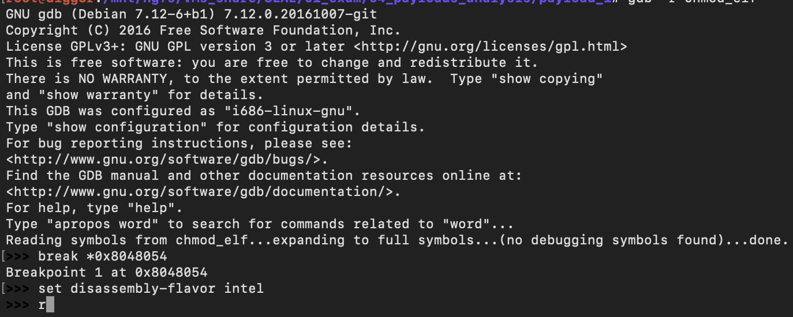
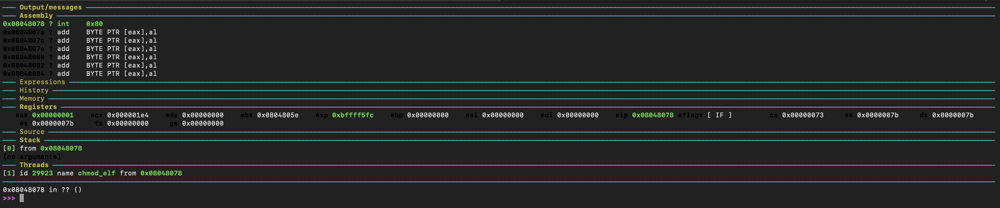

# Analysis of three payloads of my choice - part 1


##  linux/x86/chmod

I decided to analyze as first shellcode linux/x86/chmod.
Firstly, let's have a look to the basic options for the shellcode generation.

```
> msfvenom -p linux/x86/chmod --list-options

Options for payload/linux/x86/chmod:
=========================


       Name: Linux Chmod
     Module: payload/linux/x86/chmod
   Platform: Linux
       Arch: x86
Needs Admin: No
 Total size: 36
       Rank: Normal

Provided by:
    kris katterjohn <katterjohn@gmail.com>

Basic options:
Name  Current Setting  Required  Description
----  ---------------  --------  -----------
FILE  /etc/shadow      yes       Filename to chmod
MODE  0666             yes       File mode (octal)

Description:
  Runs chmod on specified file with specified mode

```
Let's generate the payload and disassemble it with ndisasm.

```
> msfvenom -p linux/x86/chmod FILE=/tmp/test.txt/ MODE=0744 -f raw | ndisasm -b32 -

Payload size: 38 bytes

00000000  99                cdq
00000001  6A0F              push byte +0xf
00000003  58                pop eax
00000004  52                push edx
00000005  E80E000000        call 0x18
0000000A  2F                das
0000000B  746D              jz 0x7a
0000000D  702F              jo 0x3e
0000000F  7465              jz 0x76
00000011  7374              jnc 0x87
00000013  2E7478            cs jz 0x8e
00000016  7400              jz 0x18
00000018  5B                pop ebx
00000019  68E4010000        push dword 0x1e4
0000001E  59                pop ecx
0000001F  CD80              int 0x80
00000021  6A01              push byte +0x1
00000023  58                pop eax
00000024  CD80              int 0x80
```

The code looks to be very compact and the information is enough to understand easily any action it performs. 
Let's analyze it statically commenting each instruction.

```
00000000  99                cdq              ; convert DWORD in EAX to a signed quad word in edx:eax, the goal here is clearing edx register
00000001  6A0F              push byte +0xf   ; push on the stack the value 0x0000000f (15), that is the syscall number for chmod (/usr/include/i386-linux-gnu/asm/unistd_32.h)
00000003  58                pop eax          ; retrieve the syscall number from the stack and place it in the eax register
00000004  52                push edx         ; push on the stack 0x00000000
00000005  E80E000000        call 0x18        ; set the EIP address to 0x18 and push 0x0000000A on the stack (trick to have access to a string without having a disposal a data section
0000000A  2F                das              ; /
0000000B  746D              jz 0x7a          ; tm
0000000D  702F              jo 0x3e          ; p/
0000000F  7465              jz 0x76          ; te
00000011  7374              jnc 0x87         ; st
00000013  2E7478            cs jz 0x8e       ; .tx
00000016  7400              jz 0x18          ; t 0x00 (end of string)
00000018  5B                pop ebx          ; retrieve the address of where is located the name of the file (0x0000000A)
00000019  68E4010000        push dword 0x1e4 ; push on the stack 484 that is the value of the mask to apply to the file (0744)
0000001E  59                pop ecx          ; retrive the mask value and store it in ecx
0000001F  CD80              int 0x80         ; interrupt to call the chmod sycall
00000021  6A01              push byte +0x1   ; push on the stack the value 0x00000001 that is the value of the exit syscall
00000023  58                pop eax          ; retrieve the value of the exit syscall
00000024  CD80              int 0x80         ; interrupt to call the exit sycall
```

Given the signature of chmod and exit syscall:

```
> man 2 chmod
int chmod(const char *pathname, mode_t mode);
> man 2 exit
void _exit(int status)
```
our analysis looks to be correct, but to have total certainty let's run it using gdb.
The most direct way to do so, without having to write a c program where the shellcode is executed, is using msfvenom and generate directly an elf binary:

```
> msfvenom -p linux/x86/chmod FILE=/tmp/test.txt MODE=0744 -f elf -o chmod_elf
```
Let's run the binary using gdb.

Firstly the entry point was identified and a breakpoint was set there. Also the flavor of the code to be shown has been changed to intel.



I stepped till the execution of the chmod syscall to check the status of the registers.


The status of the register is as expected: 

* eax contains the syscall number
* ebx contains the address where the file name is located. The memory inspection is a proof of that.
* ecx contains the mask to assign to the file, 0x1e4

Let's go further till the exit syscall is ready to be triggered.



The status of the register is as expected:

* eax contains the syscall number
* bl contains the status code that will be returned (0x52)

The program concludes successfully, let's check status code.


The program exited with 94 as status code, which is in hex 0x52 as expected.

Great! Analysis completed.

<br/>

---

*This blog post has been created for completing the requirements of the SecurityTube Linux Assembly Expert certification.*

<http://securitytube-training.com/online-courses/security-tube-linux-assembly-expert>

*Student-ID: PA-8733*