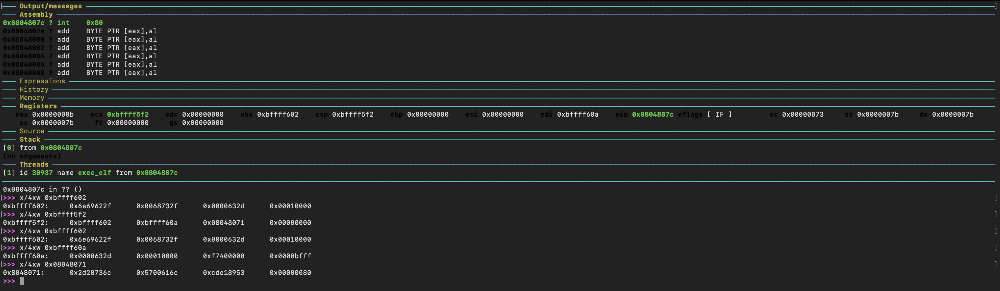

# Analysis of three payloads of my choice - part 2


##  linux/x86/exec

I decided to analyze as second shellcode linux/x86/exec.
Firstly, let's have a look to the basic options for the shellcode generation.

```
> msfvenom -p linux/x86/exec --list-options

Options for payload/linux/x86/exec:
=========================


       Name: Linux Execute Command
     Module: payload/linux/x86/exec
   Platform: Linux
       Arch: x86
Needs Admin: No
 Total size: 36
       Rank: Normal

Provided by:
    vlad902 <vlad902@gmail.com>

Basic options:
Name  Current Setting  Required  Description
----  ---------------  --------  -----------
CMD                    yes       The command string to execute

Description:
  Execute an arbitrary command

```

Let's generate the payload and disassemble it with ndisasm.

```
> msfvenom -p linux/x86/exec CMD="ls -la" -f raw | ndisasm -b32 -

Payload size: 42 bytes

00000000  6A0B              push byte +0xb
00000002  58                pop eax
00000003  99                cdq
00000004  52                push edx
00000005  66682D63          push word 0x632d
00000009  89E7              mov edi,esp
0000000B  682F736800        push dword 0x68732f
00000010  682F62696E        push dword 0x6e69622f
00000015  89E3              mov ebx,esp
00000017  52                push edx
00000018  E807000000        call 0x24
0000001D  6C                insb
0000001E  7320              jnc 0x40
00000020  2D6C610057        sub eax,0x5700616c
00000025  53                push ebx
00000026  89E1              mov ecx,esp
00000028  CD80              int 0x80
```

As the previous shellcode analysed, it looks very compact and should be easy to understand any action it performs.
Let's analyze it statically commenting each instruction.

```
00000000  6A0B              push byte +0xb        ; push on the stack the value 0x0000000b (11), that is the syscall number for execve (/usr/include/i386-linux-gnu/asm/unistd_32.h)
00000002  58                pop eax               ; retrieve the syscall number from the stack and place it in the eax register
00000003  99                cdq                   ; convert DWORD in EAX to a signed quad word in edx:eax, the goal here is clearing edx register
00000004  52                push edx              ; push on the stack 0x00000000
00000005  66682D63          push word 0x632d      ; c-
00000009  89E7              mov edi,esp           ; move the pointer to c- in edi register
0000000B  682F736800        push dword 0x68732f   ; push on the stack hs/
00000010  682F62696E        push dword 0x6e69622f ; push on the stack nib/
00000015  89E3              mov ebx,esp           ; move the pointer to the name of the program to execute and place it in ebx
00000017  52                push edx              ; push on the stack 0x00000000
00000018  E807000000        call 0x24             ; set the EIP address to 0x24 and push 0x0000001D on the stack (trick to have access to a string without having a disposal a data section)
0000001D  6C                insb                  ; l
0000001E  7320              jnc 0x40              ; s
00000020  2D6C610057        sub eax,0x5700616c    ; push edi, -la
00000025  53                push ebx              ; push on the stack 
00000026  89E1              mov ecx,esp           ; move the pointer to the first element of the array ['/bin/sh\0','-c\0','ls -la\0'] in ecx
00000028  CD80              int 0x80              ; interrupt to call the exit sycall
``` 

Given the signature of execve syscall:

```
> man 2 execve
int execve(const char *filename, char *const argv[], char *const envp[]);
```

The following layout of the stack is expected at the moment of the execve syscall:

* **eax** register contains already the syscall number 0x0000000b
* **edx** register contains 0x00000000 as no environment variable is used

+--------
addresses growing down

0x00000000

0x0000632d ; -c string

0x0068732f ; /sh string

0x6e69622f ; /bin string - the address of this location is assigned to **ebx**

0x00000000

address to ls -la string

address to /bin/sh -c string ; the address of this location is assigned to **ecx**

+--------

Summing up, this is the call expected to execve syscall:

```
execve('/bin/sh\0',['/bin/sh\0','-c\0','ls -la\0'], '\0')
```

Let's run the binary using gdb to verify our assumptions. The most direct way to do so, without having to write a c program where the shellcode is executed, is using msfvenom and generate directly an elf binary:

```
msfvenom -p linux/x86/exec CMD="ls -la" -f elf -o exec_elf
```

Now, let's run the binary using gdb.


I stepped till the execution of the execve syscall to check the status of the registers.



Our assumptions looks to be right!

* **eax** register contains the syscall number *0x0000000b*;
* **ebx** register contains *0xbffff602*, which is the pointer to the memory location where /bin/bash\0 is location. Check the result of the memory inspection for a proof of this;
* **ecx** register contains *0xbffff5f2*, which is the pointer to the memory location where the pointers to '/bin/sh\0', '-c\0', 'ls -la\0' are located. Check the result of the memory inspection for a proof of this.

Great! Analysis completed.

<br/>

---

*This blog post has been created for completing the requirements of the SecurityTube Linux Assembly Expert certification.*

<http://securitytube-training.com/online-courses/security-tube-linux-assembly-expert>

*Student-ID: PA-8733*